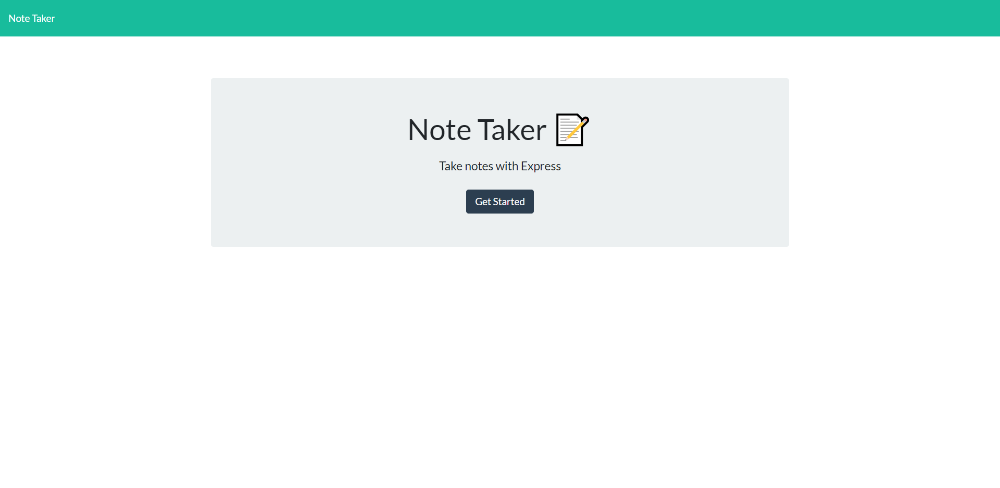
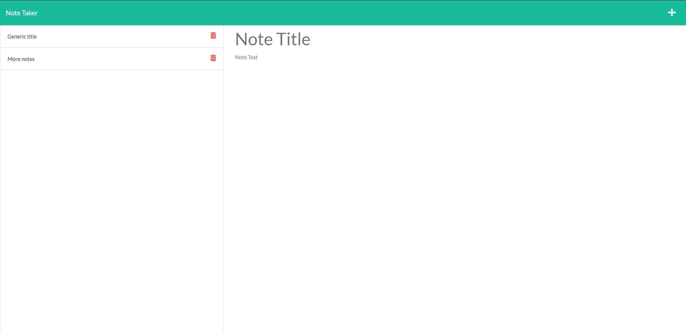
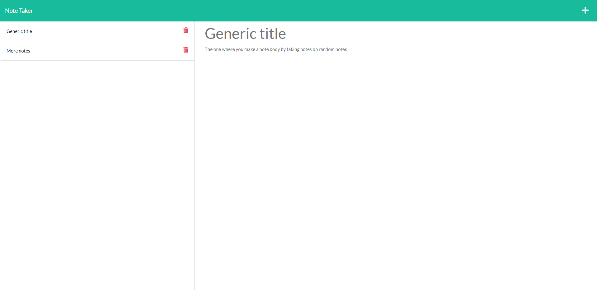

# NoteTaker

In this project I setup a server for a note taking application. The frontend was already built so my objective was to refactor the backend.

The objectives to complete this Project include the following:

After opening the Note Taker...
* The user is directed to a landing page with link to the notes page
* The notes page includes: 
* Existing notes appear on the left column
* Empty fields to add new notes in the right column
* After entering note data then a save iconn appears in the nav and appears in the left column after clicking
* When clicking on a note from the left column it is displayed to the right column
* If the plus icon is clicked the field updates to add a new blank note

# Homepage

# Adding a Note

# View a note

View Live Webpage!
https://take-your-note.herokuapp.com/